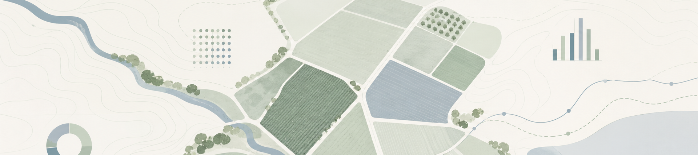

# AgroCMS

**Field Operations and Compliance Dashboard**


> **Synthetic portfolio project.** Not affiliated with Extractas Bioscience, PACB, the Department of Health, or any regulator. All data is algorithmically generated for demonstration purposes only.

---

## Live Demo

[View on Streamlit Community Cloud](https://agrocms-emmanuel2507projects.streamlit.app)

> If the app is sleeping, click "Wake app" and allow 30-60 seconds for cold start and database initialisation.

---

## Project Summary

AgroCMS simulates an end-to-end field operations reporting and compliance platform for a pharmaceutical poppy crop management system, modelled on the structure of Tasmania's regulated alkaloid industry.

The project covers the full operational lifecycle: grower contracting, sowing declarations, paddock monitoring, statutory compliance checks, harvest reconciliation, grower payments, and ML-based yield forecasting. It is designed to demonstrate the analytical, engineering, and domain skills relevant to a **Field Operations Data Analyst** role in regulated agriculture.

---

## Why This Project Is Relevant

| Skill Area | How It Is Demonstrated |
|---|---|
| Crop management systems | Multipage dashboard covering contracts, paddocks, and three growing seasons |
| Field operations reporting | Sowing declarations, harvest reconciliation, and pesticide application logs |
| Statutory compliance | Licence expiry tracking, withholding period breach detection, exception triage |
| Grower payment reconciliation | Contracted vs actual yield, cost-per-ha modelling, budget vs actual variance |
| Data quality checks | Automated validation across all entity types with a downloadable exceptions report |
| Yield forecasting | HistGradientBoostingRegressor with monotonic constraints and 90% confidence intervals |
| Spatial data | Folium choropleth map with paddock polygons, popups, and yield performance overlay |
| PDF reporting | Jinja2 and WeasyPrint statutory report generation (licence summary, harvest reconciliation, pesticide log) |
| Python and SQL | SQLAlchemy ORM, Streamlit, pandas, Plotly |

---

## Key Features

- **Season Overview** - KPIs, yield by region, and harvest progress for the selected season
- **Growers and Contracts** - Contracted growers with fulfilment tracking, performance bands, and payment status
- **Compliance** - Licence status, sowing declarations, harvest reconciliation, and pesticide withholding breaches
- **Yield Forecast** - Interactive ML scenario tool with confidence intervals and estimated revenue
- **Paddock Map** - Folium choropleth with paddock-level detail, soil type, and yield overlay
- **Data Quality** - Automated CMS validation checks with a downloadable exceptions report
- **Payments** - Payment reconciliation, cost breakdown by type, and budget vs actual analysis
- **Methodology** - Full project documentation covering the data model, ML approach, and compliance rules

---

## Tech Stack

| Layer | Technology |
|---|---|
| Backend / ORM | Python, SQLAlchemy 2.0, SQLite |
| Dashboard | Streamlit 1.58 multipage app |
| Visualisation | Plotly Express and Graph Objects |
| Machine Learning | scikit-learn HistGradientBoostingRegressor |
| Geospatial | Folium and streamlit-folium |
| PDF Reports | Jinja2 and WeasyPrint |
| Deployment | Streamlit Community Cloud |

---

## Data and Assumptions

All data is synthetically generated in `backend/seed_data.py` using a fixed random seed (42) for full reproducibility.

| Entity | Count |
|---|---|
| Growers | 20 across 5 Northern Tasmania regions |
| Paddocks | 50 (2-3 per grower) |
| Seasons | 2022-23, 2023-24, 2024-25 |
| Contracts | 60 (one per grower per season) |
| Sowing records | 150 |
| Harvest records | 145 |
| Pesticide applications | 455 |
| Crop cost rows | 420 |

**Key assumptions:**

- Yield range: 8-14 kg/ha, driven by variety, soil type, rainfall, temperature, and seed rate
- Price range: AUD $55-75 per kg
- Paddock coordinates are mathematically placed in the Westbury to Latrobe corridor and do not represent real cadastral boundaries
- The ML model is trained on approximately 100 synthetic records and is an illustrative proof-of-concept only
- Compliance rules are simplified representations of statutory obligations and do not constitute legal advice

---

## How to Run Locally

### 1. Clone the repository

```bash
git clone https://github.com/emmanuel2507projects/agrocms.git
cd agrocms
```

### 2. Install dependencies

```bash
pip install -r requirements.txt
```

> **WeasyPrint on Windows** requires the GTK3 runtime. See the [WeasyPrint installation guide](https://doc.courtbouillon.org/weasyprint/stable/first_steps.html). PDF generation falls back to HTML if WeasyPrint is unavailable.

### 3. Seed the database

```bash
python backend/seed_data.py
# To reset an existing database: python backend/seed_data.py --reset
```

This creates `agrocms.db` and writes `data/paddocks.geojson`.

### 4. Train the ML model

```bash
python ml/train.py
```

Trains on 2022-23 and 2023-24 seasons, validates on 2024-25, and saves `ml/model.pkl`.

### 5. Launch the dashboard

```bash
streamlit run dashboard/app.py
```

Open [http://localhost:8501](http://localhost:8501) in your browser.

> **Note:** On Streamlit Community Cloud the database is initialised automatically on cold start. No manual seeding is needed.

---

## Repository Structure

```
agrocms/
├── backend/
│   ├── database.py          SQLAlchemy engine and session
│   ├── models.py            ORM models (7 tables)
│   └── seed_data.py         Synthetic data generator
├── ml/
│   ├── features.py          Feature engineering and constants
│   ├── train.py             Model training and evaluation
│   └── model.pkl            Saved model artefact
├── reports/
│   ├── generate.py          PDF report generation
│   └── templates/           Jinja2 HTML templates
├── dashboard/
│   ├── app.py               Streamlit entry point and navigation
│   ├── home.py              Homepage
│   ├── utils.py             Shared helpers and CSS
│   └── pages/
│       ├── 1_overview.py    Season KPIs and charts
│       ├── 2_growers.py     Grower fulfilment table
│       ├── 3_compliance.py  Compliance badges and PDF export
│       ├── 4_forecast.py    ML yield forecast
│       ├── 5_map.py         Folium paddock map
│       ├── 6_data_quality.py Data quality checks
│       ├── 7_payments.py    Payment reconciliation
│       └── 8_methodology.py Project documentation
├── data/
│   └── paddocks.geojson     GeoJSON paddock boundaries
├── assets/
│   └── field-analytics-banner.png
├── .streamlit/
│   └── config.toml
└── requirements.txt
```

---

## Screenshots



| Page | Description |
|---|---|
| Home | Hero card with live season KPIs, workflow diagram, and module navigation |
| Executive Overview | Season-level yield, compliance, and harvest progress charts |
| Compliance | Colour-coded compliance status with PDF report export |
| Yield Forecast | Interactive ML scenario tool with confidence intervals |
| Paddock Map | Choropleth map with paddock-level popups |

---

## Disclaimer

This is a synthetic portfolio project created for demonstration purposes. It is not affiliated with, endorsed by, or representative of:

- Extractas Bioscience Pty Ltd
- Tasmanian Alkaloids Pty Ltd
- Poppy Australia Pty Ltd
- PACB (Poppy Advisory and Control Board)
- The Department of Health or any other regulatory authority

All grower names, licence numbers, yield figures, payment amounts, and operational data are algorithmically generated and bear no relation to any real person, business, or regulatory record.
